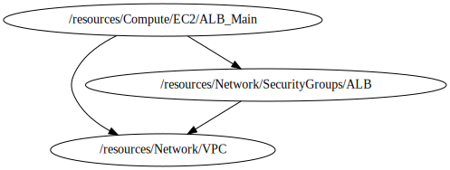

<!-- BEGIN_TF_DOCS -->

# Module for ALB deployment
* This module a create a custom ALB from aws public Repository based on **terraform-aws-modules/alb/aws**
## Source Module info
- **version**: = "~> 6.0"
- **Link**:  [terraform-aws-modules/s3-bucket/aws](github.com/terraform-aws-modules/terraform-aws-alb)

## Code Dependencies Graph
<center>



##### **Dependency Graph**

</center>

---

## Example parameter options for each environment

```hcl

locals {
  env = {
    default = {
      create_lb                        = false
      name                             = "${terraform.workspace}-${var.project}-alb"
      load_balancer_type               = "application"
      internal                         = false
      drop_invalid_header_fields       = true
      vpc_id                           = var.vpc_id
      subnet_ids                       = var.subnet_ids
      security_groups_ids              = [var.sg_alb_id]
      enable_cross_zone_load_balancing = true
      target_groups = [
        {
          name_prefix          = "app1"
          backend_protocol     = "HTTP"
          backend_port         = 80
          target_type          = "ip"
          deregistration_delay = 10
          health_check = {
            enabled             = true
            path                = "/"
            interval            = 30
            healthy_threshold   = 5
            unhealthy_threshold = 5
            timeout             = 10
            protocol            = "HTTP"
            matcher             = "200-399"
          }
        }
      ]
      http_tcp_listeners = [
        {
          port               = 80
          protocol           = "HTTP"
          target_group_index = 0
        }
      ]
      https_listeners = [
        # {
        #   port               = 443
        #   protocol           = "HTTPS"
        #   ssl_policy         = "ELBSecurityPolicy-2016-08"
        #   certificate_arn    = var.acm_certificate_arn
        #   target_group_index = 0
        # }
      ]
      http_tcp_listener_rules = []
      https_listener_rules    = []
      tags = {
        Environment = terraform.workspace
      }
    }
    dev = {
      create_lb = true
    }
    prod = {
      create_lb = true
    }
  }
  environment_vars = contains(keys(local.env), terraform.workspace) ? terraform.workspace : "default"
  workspace        = merge(local.env["default"], local.env[local.environment_vars])
}

```

## Providers

No providers.

## Outputs

| Name | Description |
|------|-------------|
| <a name="output_http_tcp_listener_arns"></a> [http\_tcp\_listener\_arns](#output\_http\_tcp\_listener\_arns) | The ARN of the TCP and HTTP load balancer listeners created. |
| <a name="output_http_tcp_listener_ids"></a> [http\_tcp\_listener\_ids](#output\_http\_tcp\_listener\_ids) | The IDs of the TCP and HTTP load balancer listeners created. |
| <a name="output_https_listener_arns"></a> [https\_listener\_arns](#output\_https\_listener\_arns) | The ARNs of the HTTPS load balancer listeners created. |
| <a name="output_https_listener_ids"></a> [https\_listener\_ids](#output\_https\_listener\_ids) | The IDs of the load balancer listeners created. |
| <a name="output_lb_arn"></a> [lb\_arn](#output\_lb\_arn) | The ID and ARN of the load balancer we created. |
| <a name="output_lb_arn_suffix"></a> [lb\_arn\_suffix](#output\_lb\_arn\_suffix) | ARN suffix of our load balancer - can be used with CloudWatch. |
| <a name="output_lb_dns_name"></a> [lb\_dns\_name](#output\_lb\_dns\_name) | The DNS name of the load balancer. |
| <a name="output_lb_id"></a> [lb\_id](#output\_lb\_id) | The ID and ARN of the load balancer we created. |
| <a name="output_lb_zone_id"></a> [lb\_zone\_id](#output\_lb\_zone\_id) | The zone\_id of the load balancer to assist with creating DNS records. |
| <a name="output_target_group_arn_suffixes"></a> [target\_group\_arn\_suffixes](#output\_target\_group\_arn\_suffixes) | ARN suffixes of our target groups - can be used with CloudWatch. |
| <a name="output_target_group_arns"></a> [target\_group\_arns](#output\_target\_group\_arns) | ARNs of the target groups. Useful for passing to your Auto Scaling group. |
| <a name="output_target_group_attachments"></a> [target\_group\_attachments](#output\_target\_group\_attachments) | ARNs of the target group attachment IDs. |
| <a name="output_target_group_names"></a> [target\_group\_names](#output\_target\_group\_names) | Name of the target group. Useful for passing to your CodeDeploy Deployment Group. |

## Inputs

| Name | Description | Type | Default | Required |
|------|-------------|------|---------|:--------:|
| <a name="input_profile"></a> [profile](#input\_profile) | Variable for credentials management. | `map` | <pre>{<br>  "default": {<br>    "profile": "sh-gencloudtest",<br>    "region": "us-east-1"<br>  },<br>  "dev": {<br>    "profile": "sh-gencloudtest",<br>    "region": "us-east-1"<br>  },<br>  "prod": {<br>    "profile": "sh-gencloudtest",<br>    "region": "us-east-1"<br>  }<br>}</pre> | no |
| <a name="input_project"></a> [project](#input\_project) | Project name | `string` | `"ecs-fargate-pattern"` | no |
| <a name="input_required_tags"></a> [required\_tags](#input\_required\_tags) | A map of tags to add to all resources | `map(string)` | <pre>{<br>  "ManagedBy": "Terraform-Terragrunt",<br>  "Project": "ecs-fargate-pattern"<br>}</pre> | no |
| <a name="input_sg_alb_id"></a> [sg\_alb\_id](#input\_sg\_alb\_id) | Security Group ID for load Balancer | `string` | n/a | yes |
| <a name="input_subnet_ids"></a> [subnet\_ids](#input\_subnet\_ids) | Private subnet id list | `list(string)` | n/a | yes |
| <a name="input_vpc_id"></a> [vpc\_id](#input\_vpc\_id) | VPC id where the load balancer and other resources will be deployed | `string` | n/a | yes |
<!-- END_TF_DOCS -->