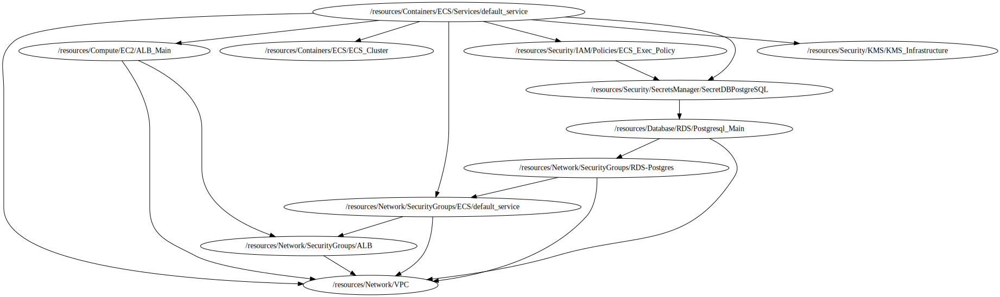

<!-- BEGIN_TF_DOCS -->

# Module for Task Definition
* This module a creates a custom Task Definition from aws local Repository based on **../../../../../modules/aws-ecs-fargate/aws-ecs-tsk-def**
## Source Module info
- **version**: = "1.0"
- **Link**:  [../../../../../modules/aws-ecs-fargate/aws-ecs-tsk-def]()

## Code Dependencies Graph
<center>



##### **Dependency Graph**

</center>

---

## Example parameter options for each environment

```hcl

locals {
  env = {
    default = {
      # Variables for the Task module
      create_task          = false
      family               = "${terraform.workspace}-${var.project}-task"
      mem_task             = 1024
      cpu_task             = 512
      task_role_policy_arn = []
      exec_role_policy_arn = [var.exec_policy_arn]
      container_def = jsonencode([
        {
          name      = "apache"
          image     = "httpd:2.4"
          cpu       = 256
          memory    = 512
          essential = true
          portMappings = [
            {
              hostPort      = 80
              containerPort = 80
              protocol      = "tcp"
            }
          ]
          environment = []
          command     = []
          entryPoint  = []
          secrets = [
            { "name" = "DB_TYPE", "valueFrom" = "${var.secrets_manager_arn}:engine::" },
            { "name" = "DB_HOST", "valueFrom" = "${var.secrets_manager_arn}:host::" },
            { "name" = "DB_PORT", "valueFrom" = "${var.secrets_manager_arn}:port::" },
            { "name" = "DB_USER", "valueFrom" = "${var.secrets_manager_arn}:username::" },
            { "name" = "DB_PASS", "valueFrom" = "${var.secrets_manager_arn}:password::" },
            { "name" = "DB_NAME", "valueFrom" = "${var.secrets_manager_arn}:dbname::" }
          ]
          logConfiguration = {
            logDriver = "awslogs"
            options = {
              awslogs-stream-prefix = "ecs",
              awslogs-group         = "ecs-logs-${terraform.workspace}-${var.project}-task"
              awslogs-region        = var.profile[terraform.workspace]["region"]
            }
          }
        }
      ])
      log_group_name              = "ecs-logs-${terraform.workspace}-${var.project}-task"
      log_group_key_id            = var.log_group_key_id
      log_group_retention_in_days = 30


      # Variables for the Service module
      create_service = false
      name_service   = "${terraform.workspace}-${var.project}-service"
      cluster_arn    = var.cluster_arn
      # task_arn       = module.aws-tsk-def.task_def_arn

      desired_count        = 2
      platform_version     = "LATEST"
      force_new_deployment = false

      subnets_service  = [var.subnets_service[0], var.subnets_service[1]]
      security_groups  = [var.security_groups_service]
      assign_public_ip = false

      alb_target_group_arn = var.target_group_arn[0]
      container_name       = "apache"
      container_port       = 80

      use_namespace = false
      namespace_id  = ""


      # Variables for the AutoScaling
      name_autoscale = "${terraform.workspace}-${var.project}"
      cluster_name   = var.cluster_name
      # service_name_var = module.aws-ecs-svc.service_name

      ecs_autoscale_min_instances = 1
      ecs_autoscale_max_instances = 4

      scale_name_container    = "apache"
      scale_down_cron         = "cron(00 23 * * ? *)"
      scale_up_cron           = "cron(00 13 * * ? *)"
      scale_down_min_capacity = 0
      scale_down_max_capacity = 0

      tags = {
        Environment = terraform.workspace
        layer       = "Containers"
      }
    }
    dev = {
      create_task    = true
      create_service = true
    }
    prod = {
      create_task    = true
      create_service = true
    }
  }
  environment_vars = contains(keys(local.env), terraform.workspace) ? terraform.workspace : "default"
  workspace        = merge(local.env["default"], local.env[local.environment_vars])
}

```

## Providers

No providers.

## Outputs

| Name | Description |
|------|-------------|
| <a name="output_service_id"></a> [service\_id](#output\_service\_id) | AWS ECS Service ID |
| <a name="output_service_name"></a> [service\_name](#output\_service\_name) | AWS ECS Service Name |
| <a name="output_task_def_arn"></a> [task\_def\_arn](#output\_task\_def\_arn) | Task definition arn |
| <a name="output_task_def_id"></a> [task\_def\_id](#output\_task\_def\_id) | Task definition Id |

## Inputs

| Name | Description | Type | Default | Required |
|------|-------------|------|---------|:--------:|
| <a name="input_cluster_arn"></a> [cluster\_arn](#input\_cluster\_arn) | CLuster Arn for service | `string` | `""` | no |
| <a name="input_cluster_name"></a> [cluster\_name](#input\_cluster\_name) | Cluster Name for service | `string` | `""` | no |
| <a name="input_exec_policy_arn"></a> [exec\_policy\_arn](#input\_exec\_policy\_arn) | Exec policy ARN used in task | `string` | `""` | no |
| <a name="input_log_group_key_id"></a> [log\_group\_key\_id](#input\_log\_group\_key\_id) | The ARN of the KMS Key to use when encrypting log data | `string` | `""` | no |
| <a name="input_profile"></a> [profile](#input\_profile) | Variable for credentials management. | `map` | <pre>{<br>  "default": {<br>    "profile": "sh-gencloudtest",<br>    "region": "us-east-1"<br>  },<br>  "dev": {<br>    "profile": "sh-gencloudtest",<br>    "region": "us-east-1"<br>  },<br>  "prod": {<br>    "profile": "sh-gencloudtest",<br>    "region": "us-east-1"<br>  }<br>}</pre> | no |
| <a name="input_project"></a> [project](#input\_project) | Project name | `string` | `"ecs-fargate-pattern"` | no |
| <a name="input_required_tags"></a> [required\_tags](#input\_required\_tags) | A map of tags to add to all resources | `map(string)` | <pre>{<br>  "ManagedBy": "Terraform-Terragrunt",<br>  "Project": "ecs-fargate-pattern"<br>}</pre> | no |
| <a name="input_secrets_manager_arn"></a> [secrets\_manager\_arn](#input\_secrets\_manager\_arn) | ARN for secrets manager | `string` | `""` | no |
| <a name="input_security_groups_service"></a> [security\_groups\_service](#input\_security\_groups\_service) | Security Groups for service | `string` | n/a | yes |
| <a name="input_subnets_service"></a> [subnets\_service](#input\_subnets\_service) | Subnets to run services | `list(any)` | n/a | yes |
| <a name="input_target_group_arn"></a> [target\_group\_arn](#input\_target\_group\_arn) | Target group | `list(string)` | n/a | yes |
<!-- END_TF_DOCS -->