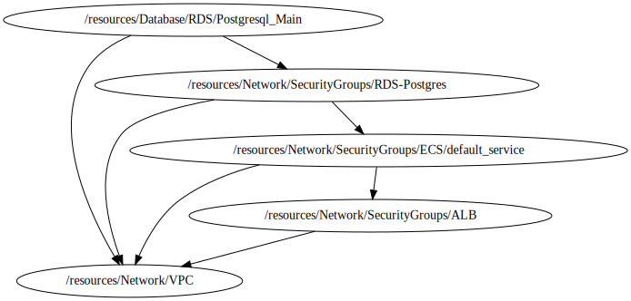

<!-- BEGIN_TF_DOCS -->

# RDS Database

This module create an Autoscaling group based on **terraform-aws-modules/rds/aws**
## Source Module info
- **version**: 4.7.0
- **Link**:  [terraform-aws-modules/autoscaling/rds](github.com/terraform-aws-modules/terraform-aws-rds)

## Code Dependencies Graph
<center>



##### **Dependency Graph**

</center>

---

## Example parameter options for each environment

```hcl

locals {
  env = {
    default = {
      create_db_instance        = false
      create_db_subnet_group    = false
      create_db_option_group    = false
      create_monitoring_role    = false
      create_db_parameter_group = false

      identifier = "postgres-db"

      engine               = "postgres"
      engine_version       = "11.13"
      family               = "postgres11"
      major_engine_version = "11"
      instance_class       = "db.t3.small"

      allocated_storage     = 20
      max_allocated_storage = 30
      storage_encrypted     = true

      db_name                = "DBpostgres"
      username               = "admindb"
      create_random_password = true
      random_password_length = 14

      port                   = 5432
      multi_az               = true
      subnet_ids             = var.database_subnets_ids
      vpc_security_group_ids = var.vpc_security_group_ids
      db_subnet_group_name   = var.db_subnet_group_name

      maintenance_window              = "Mon:00:00-Mon:03:00"
      backup_window                   = "03:00-06:00"
      enabled_cloudwatch_logs_exports = ["postgresql", "upgrade"]

      backup_retention_period = 0
      skip_final_snapshot     = true
      deletion_protection     = false

      performance_insights_enabled          = false
      performance_insights_retention_period = 0
      monitoring_interval                   = 0
      parameters = [
        {
          name  = "autovacuum"
          value = 1
        },
        {
          name  = "client_encoding"
          value = "utf8"
        }
      ]
      options = []

      tags = {
        Environment = terraform.workspace
      }
    }
    dev = {
      create_db_instance = true
    }
    prod = {
      create_db_instance = true
    }
  }
  environment_vars = contains(keys(local.env), terraform.workspace) ? terraform.workspace : "default"
  workspace        = merge(local.env["default"], local.env[local.environment_vars])
}

```

## Providers

No providers.

## Outputs

| Name | Description |
|------|-------------|
| <a name="output_db_engine"></a> [db\_engine](#output\_db\_engine) | The Engine version for database |
| <a name="output_db_enhanced_monitoring_iam_role_arn"></a> [db\_enhanced\_monitoring\_iam\_role\_arn](#output\_db\_enhanced\_monitoring\_iam\_role\_arn) | The Amazon Resource Name (ARN) specifying the monitoring role |
| <a name="output_db_instance_address"></a> [db\_instance\_address](#output\_db\_instance\_address) | The address of the RDS instance |
| <a name="output_db_instance_arn"></a> [db\_instance\_arn](#output\_db\_instance\_arn) | The ARN of the RDS instance |
| <a name="output_db_instance_availability_zone"></a> [db\_instance\_availability\_zone](#output\_db\_instance\_availability\_zone) | The availability zone of the RDS instance |
| <a name="output_db_instance_domain"></a> [db\_instance\_domain](#output\_db\_instance\_domain) | The ID of the Directory Service Active Directory domain the instance is joined to |
| <a name="output_db_instance_domain_iam_role_name"></a> [db\_instance\_domain\_iam\_role\_name](#output\_db\_instance\_domain\_iam\_role\_name) | The name of the IAM role to be used when making API calls to the Directory Service. |
| <a name="output_db_instance_endpoint"></a> [db\_instance\_endpoint](#output\_db\_instance\_endpoint) | The connection endpoint |
| <a name="output_db_instance_hosted_zone_id"></a> [db\_instance\_hosted\_zone\_id](#output\_db\_instance\_hosted\_zone\_id) | The canonical hosted zone ID of the DB instance (to be used in a Route 53 Alias record) |
| <a name="output_db_instance_id"></a> [db\_instance\_id](#output\_db\_instance\_id) | The RDS instance ID |
| <a name="output_db_instance_name"></a> [db\_instance\_name](#output\_db\_instance\_name) | The database name |
| <a name="output_db_instance_password"></a> [db\_instance\_password](#output\_db\_instance\_password) | The database password (this password may be old, because Terraform doesn't track it after initial creation) |
| <a name="output_db_instance_port"></a> [db\_instance\_port](#output\_db\_instance\_port) | The database port |
| <a name="output_db_instance_resource_id"></a> [db\_instance\_resource\_id](#output\_db\_instance\_resource\_id) | The RDS Resource ID of this instance |
| <a name="output_db_instance_status"></a> [db\_instance\_status](#output\_db\_instance\_status) | The RDS instance status |
| <a name="output_db_instance_username"></a> [db\_instance\_username](#output\_db\_instance\_username) | The master username for the database |
| <a name="output_db_parameter_group_arn"></a> [db\_parameter\_group\_arn](#output\_db\_parameter\_group\_arn) | The ARN of the db parameter group |
| <a name="output_db_parameter_group_id"></a> [db\_parameter\_group\_id](#output\_db\_parameter\_group\_id) | The db parameter group id |
| <a name="output_db_subnet_group_arn"></a> [db\_subnet\_group\_arn](#output\_db\_subnet\_group\_arn) | The ARN of the db subnet group |
| <a name="output_db_subnet_group_id"></a> [db\_subnet\_group\_id](#output\_db\_subnet\_group\_id) | The db subnet group name |

## Inputs

| Name | Description | Type | Default | Required |
|------|-------------|------|---------|:--------:|
| <a name="input_database_subnets_ids"></a> [database\_subnets\_ids](#input\_database\_subnets\_ids) | n/a | `list(string)` | `[]` | no |
| <a name="input_db_subnet_group_name"></a> [db\_subnet\_group\_name](#input\_db\_subnet\_group\_name) | Database subnet group | `string` | `""` | no |
| <a name="input_profile"></a> [profile](#input\_profile) | Variable for credentials management. | `map` | <pre>{<br>  "default": {<br>    "profile": "sh-gencloudtest",<br>    "region": "us-east-1"<br>  },<br>  "dev": {<br>    "profile": "sh-gencloudtest",<br>    "region": "us-east-1"<br>  },<br>  "prod": {<br>    "profile": "sh-gencloudtest",<br>    "region": "us-east-1"<br>  }<br>}</pre> | no |
| <a name="input_project"></a> [project](#input\_project) | Project name | `string` | `"ecs-fargate-pattern"` | no |
| <a name="input_required_tags"></a> [required\_tags](#input\_required\_tags) | A map of tags to add to all resources | `map(string)` | <pre>{<br>  "ManagedBy": "Terraform-Terragrunt",<br>  "Project": "ecs-fargate-pattern"<br>}</pre> | no |
| <a name="input_vpc_security_group_ids"></a> [vpc\_security\_group\_ids](#input\_vpc\_security\_group\_ids) | List of VPC security groups to associate | `list(string)` | `[]` | no |
<!-- END_TF_DOCS -->