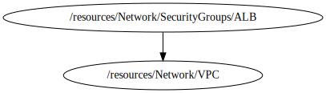

<!-- BEGIN_TF_DOCS -->

# Module for SG ALB deployment
* This module a create a custom Security Group from aws public Repository based on **terraform-aws-modules/security-group/aws**
## Source Module info
- **version**: = "4.13.1"
- **Link**:  [terraform-aws-modules/security-group/aws](github.com/terraform-aws-modules/terraform-aws-security-group)

## Code Dependencies Graph
<center>



##### **Dependency Graph**

</center>

---

## Example parameter options for each environment

```hcl

locals {
  env = {
    default = {
      create          = false
      name            = "${terraform.workspace}-${var.project}-alb-sg"
      description     = "Security Group for ALB"
      vpc_id          = var.vpc_id
      use_name_prefix = false
      ingress_with_cidr_blocks = [
        {
          from_port   = 80
          to_port     = 80
          protocol    = "tcp"
          description = "Service ports (ipv4). All"
          cidr_blocks = "0.0.0.0/0"
        },
        {
          from_port   = 443
          to_port     = 443
          protocol    = "tcp"
          description = "Service ports (ipv4). All"
          cidr_blocks = "0.0.0.0/0"
        }
      ]
      egress_with_cidr_blocks = [
        {
          rule        = "all-tcp"
          cidr_blocks = "0.0.0.0/0"
        }
      ]
      ingress_with_source_security_group_id = []
      egress_with_source_security_group_id  = []
      tags = {
        Environment = terraform.workspace
      }
    }
    dev = {
      create = true
    }
    prod = {
      create = true
    }
  }
  environment_vars = contains(keys(local.env), terraform.workspace) ? terraform.workspace : "default"
  workspace        = merge(local.env["default"], local.env[local.environment_vars])
}

```

## Providers

No providers.

## Outputs

| Name | Description |
|------|-------------|
| <a name="output_security_group_description"></a> [security\_group\_description](#output\_security\_group\_description) | The description of the security group |
| <a name="output_security_group_id"></a> [security\_group\_id](#output\_security\_group\_id) | The ID of the security group |
| <a name="output_security_group_name"></a> [security\_group\_name](#output\_security\_group\_name) | The name of the security group |
| <a name="output_security_group_owner_id"></a> [security\_group\_owner\_id](#output\_security\_group\_owner\_id) | The owner ID |
| <a name="output_security_group_vpc_id"></a> [security\_group\_vpc\_id](#output\_security\_group\_vpc\_id) | The VPC ID |

## Inputs

| Name | Description | Type | Default | Required |
|------|-------------|------|---------|:--------:|
| <a name="input_profile"></a> [profile](#input\_profile) | Variable for credentials management. | `map` | <pre>{<br>  "default": {<br>    "profile": "sh-gencloudtest",<br>    "region": "us-east-1"<br>  },<br>  "dev": {<br>    "profile": "sh-gencloudtest",<br>    "region": "us-east-1"<br>  },<br>  "prod": {<br>    "profile": "sh-gencloudtest",<br>    "region": "us-east-1"<br>  }<br>}</pre> | no |
| <a name="input_project"></a> [project](#input\_project) | Project name | `string` | `"ecs-fargate-pattern"` | no |
| <a name="input_required_tags"></a> [required\_tags](#input\_required\_tags) | A map of tags to add to all resources | `map(string)` | <pre>{<br>  "ManagedBy": "Terraform-Terragrunt",<br>  "Project": "ecs-fargate-pattern"<br>}</pre> | no |
| <a name="input_vpc_id"></a> [vpc\_id](#input\_vpc\_id) | Variable what capture the output vpc\_id from module vpc | `string` | n/a | yes |
<!-- END_TF_DOCS -->