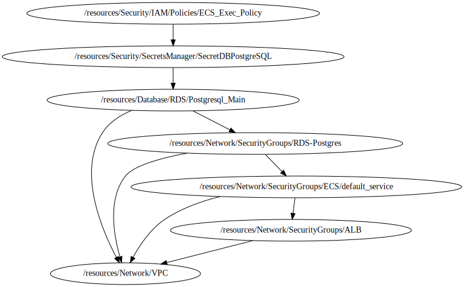

<!-- BEGIN_TF_DOCS -->

# Module for IAM policy deployment
Terraform module to provision a IAM Policy from aws public Repository based on **terraform-aws-modules/iam/aws//modules/iam-policy**

## Code Dependencies Graph
<center>



##### **Dependency Graph**

</center>

---

## Example parameter options for each environment

```hcl

locals {
  env = {
    default = {
      create_policy = false
      name          = "${terraform.workspace}-${var.project}-ecs-exec-policy"
      path          = "/"
      description   = "IAM policy for task read kms and secrets"
      tags = {
        Environment = terraform.workspace
      }
    }
    dev = {
      create_policy = true
    }
    prod = {
      create_policy = true
    }
  }
  environment_vars = contains(keys(local.env), terraform.workspace) ? terraform.workspace : "default"
  workspace        = merge(local.env["default"], local.env[local.environment_vars])
}

```

## Providers

| Name | Version |
|------|---------|
| <a name="provider_aws"></a> [aws](#provider\_aws) | 4.36.1 |

## Outputs

| Name | Description |
|------|-------------|
| <a name="output_policy_arn"></a> [policy\_arn](#output\_policy\_arn) | ARN of policy |
| <a name="output_policy_id"></a> [policy\_id](#output\_policy\_id) | ID of policy |

## Inputs

| Name | Description | Type | Default | Required |
|------|-------------|------|---------|:--------:|
| <a name="input_kms_secret_key_arn"></a> [kms\_secret\_key\_arn](#input\_kms\_secret\_key\_arn) | ARN for KMS secrets | `string` | `""` | no |
| <a name="input_profile"></a> [profile](#input\_profile) | Variable for credentials management. | `map` | <pre>{<br>  "default": {<br>    "profile": "sh-gencloudtest",<br>    "region": "us-east-1"<br>  },<br>  "dev": {<br>    "profile": "sh-gencloudtest",<br>    "region": "us-east-1"<br>  },<br>  "prod": {<br>    "profile": "sh-gencloudtest",<br>    "region": "us-east-1"<br>  }<br>}</pre> | no |
| <a name="input_project"></a> [project](#input\_project) | Project name | `string` | `"ecs-fargate-pattern"` | no |
| <a name="input_required_tags"></a> [required\_tags](#input\_required\_tags) | A map of tags to add to all resources | `map(string)` | <pre>{<br>  "ManagedBy": "Terraform-Terragrunt",<br>  "Project": "ecs-fargate-pattern"<br>}</pre> | no |
| <a name="input_secrets_manager_arn"></a> [secrets\_manager\_arn](#input\_secrets\_manager\_arn) | ARN for secrets manager | `string` | `""` | no |
<!-- END_TF_DOCS -->