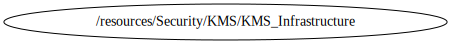

<!-- BEGIN_TF_DOCS -->

# Module for KMS deployment
Terraform module to provision a KMS based on **terraform-aws-modules/kms/aws**

## Code Dependencies Graph
<center>



##### **Dependency Graph**

</center>

---

## Example parameter options for each environment

```hcl

locals {
  env = {
    default = {
      is_enabled              = false
      deletion_window_in_days = 7
      enable_key_rotation     = true
      enable_default_policy   = false
      key_usage               = "ENCRYPT_DECRYPT"
      name                    = ["${terraform.workspace}/${var.project}/key-infraestructure"]
      description             = "Infrastructure key environment ${terraform.workspace} "
      policy                  = data.aws_iam_policy_document.key_policy_infra.json
      tags = {
        Environment = terraform.workspace
        layer       = "Security"
      }
    }
    dev = {
      is_enabled = true
    }
    prod = {
      is_enabled = true
    }
  }
  environment_vars = contains(keys(local.env), terraform.workspace) ? terraform.workspace : "default"
  workspace        = merge(local.env["default"], local.env[local.environment_vars])
}

```

## Providers

| Name | Version |
|------|---------|
| <a name="provider_aws"></a> [aws](#provider\_aws) | 4.36.1 |

## Outputs

| Name | Description |
|------|-------------|
| <a name="output_key_aliases"></a> [key\_aliases](#output\_key\_aliases) | A map of aliases created and their attributes |
| <a name="output_key_arn"></a> [key\_arn](#output\_key\_arn) | The Amazon Resource Name (ARN) of the key |
| <a name="output_key_id"></a> [key\_id](#output\_key\_id) | The globally unique identifier for the key |

## Inputs

| Name | Description | Type | Default | Required |
|------|-------------|------|---------|:--------:|
| <a name="input_profile"></a> [profile](#input\_profile) | Variable for credentials management. | `map` | <pre>{<br>  "default": {<br>    "profile": "sh-gencloudtest",<br>    "region": "us-east-1"<br>  },<br>  "dev": {<br>    "profile": "sh-gencloudtest",<br>    "region": "us-east-1"<br>  },<br>  "prod": {<br>    "profile": "sh-gencloudtest",<br>    "region": "us-east-1"<br>  }<br>}</pre> | no |
| <a name="input_project"></a> [project](#input\_project) | Project name | `string` | `"ecs-fargate-pattern"` | no |
| <a name="input_required_tags"></a> [required\_tags](#input\_required\_tags) | A map of tags to add to all resources | `map(string)` | <pre>{<br>  "ManagedBy": "Terraform-Terragrunt",<br>  "Project": "ecs-fargate-pattern"<br>}</pre> | no |
<!-- END_TF_DOCS -->