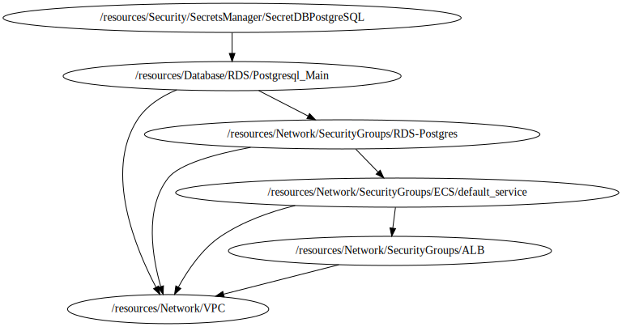

<!-- BEGIN_TF_DOCS -->

# Module for Secret Manager
* This module a creates a custom Secret Manager from aws local Repository based on **../../../../modules/aws-standart-secret**
## Source Module info
- **version**: = "1.0"
- **Link**:  [../../../../modules/aws-standart-secret]()

## Code Dependencies Graph
<center>



##### **Dependency Graph**

</center>

---

## Example parameter options for each environment

```hcl

locals {
  env = {
    default = {
      create                  = false
      name                    = "${terraform.workspace}-${var.project}-secret"
      description             = "Secret for master user on database postgresql"
      recovery_window_in_days = 0
      value = jsonencode(
        {
          "engine"              = var.db_engine
          "host"                = var.db_instance_address
          "port"                = var.db_instance_port
          "endpoint"            = var.db_instance_endpoint
          "dbname"              = var.db_instance_name
          "password"            = var.db_instance_password
          "username"            = var.db_instance_username
          "resourceId"          = var.db_instance_resource_id
          "dbClusterIdentifier" = var.db_instance_id
        }
      )
      tags = {
        Environment = terraform.workspace
        Layer       = "Security"
      }
    }
    dev = {
      create = true
    }
    prod = {
      create = true
    }
  }
  environment_vars = contains(keys(local.env), terraform.workspace) ? terraform.workspace : "default"
  workspace        = merge(local.env["default"], local.env[local.environment_vars])
}

```

## Providers

No providers.

## Outputs

| Name | Description |
|------|-------------|
| <a name="output_arn"></a> [arn](#output\_arn) | Amazon Resource Name (ARN) of the secret. |
| <a name="output_id"></a> [id](#output\_id) | Amazon Resource Name (ARN) of the secret. |
| <a name="output_kms_key_arn"></a> [kms\_key\_arn](#output\_kms\_key\_arn) | The Amazon Resource Name (ARN) of the key used to encrypt the secret. |
| <a name="output_kms_key_id"></a> [kms\_key\_id](#output\_kms\_key\_id) | The globally unique identifier for the key used to encrypt the secret. |
| <a name="output_name"></a> [name](#output\_name) | Friendly name of the secret. |

## Inputs

| Name | Description | Type | Default | Required |
|------|-------------|------|---------|:--------:|
| <a name="input_db_engine"></a> [db\_engine](#input\_db\_engine) | Database engine | `string` | n/a | yes |
| <a name="input_db_instance_address"></a> [db\_instance\_address](#input\_db\_instance\_address) | Address de RDS | `string` | n/a | yes |
| <a name="input_db_instance_endpoint"></a> [db\_instance\_endpoint](#input\_db\_instance\_endpoint) | Endpoint de RDS | `string` | n/a | yes |
| <a name="input_db_instance_id"></a> [db\_instance\_id](#input\_db\_instance\_id) | RDS Instance ID | `string` | n/a | yes |
| <a name="input_db_instance_name"></a> [db\_instance\_name](#input\_db\_instance\_name) | RDS Instance Name | `string` | n/a | yes |
| <a name="input_db_instance_password"></a> [db\_instance\_password](#input\_db\_instance\_password) | Database password | `string` | n/a | yes |
| <a name="input_db_instance_port"></a> [db\_instance\_port](#input\_db\_instance\_port) | Database Port | `number` | n/a | yes |
| <a name="input_db_instance_resource_id"></a> [db\_instance\_resource\_id](#input\_db\_instance\_resource\_id) | The RDS Resource ID of this instance | `string` | n/a | yes |
| <a name="input_db_instance_username"></a> [db\_instance\_username](#input\_db\_instance\_username) | Database User name | `string` | n/a | yes |
| <a name="input_profile"></a> [profile](#input\_profile) | Variable for credentials management. | `map` | <pre>{<br>  "default": {<br>    "profile": "sh-gencloudtest",<br>    "region": "us-east-1"<br>  },<br>  "dev": {<br>    "profile": "sh-gencloudtest",<br>    "region": "us-east-1"<br>  },<br>  "prod": {<br>    "profile": "sh-gencloudtest",<br>    "region": "us-east-1"<br>  }<br>}</pre> | no |
| <a name="input_project"></a> [project](#input\_project) | Project name | `string` | `"ecs-fargate-pattern"` | no |
| <a name="input_required_tags"></a> [required\_tags](#input\_required\_tags) | A map of tags to add to all resources | `map(string)` | <pre>{<br>  "ManagedBy": "Terraform-Terragrunt",<br>  "Project": "ecs-fargate-pattern"<br>}</pre> | no |
<!-- END_TF_DOCS -->