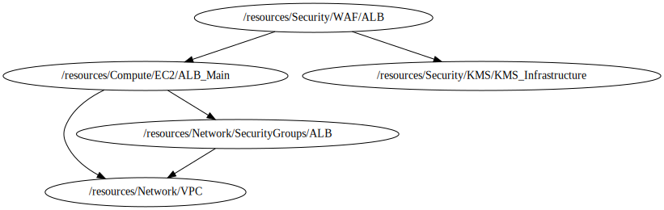

<!-- BEGIN_TF_DOCS -->

# Module for WAF deployment
* This module a create a custom AWF from local Repository based
## Source Module info
- **version**: = "1.0"
- **Link**:  [../../../../modules/aws-wafv2-alb]()

## Code Dependencies Graph
<center>



##### **Dependency Graph**

</center>

---

## Example parameter options for each environment

```hcl

locals {
  env = {
    default = {
      create                        = false
      prefix                        = format("%s-", lower(var.project))
      suffix                        = format("-%s", terraform.workspace)
      description                   = "Default WAF Rule Group"
      enable_regex_path_custom_rule = true
      regular_expression_paths = [
        {
          regex_string = "graphql"
        }
      ]
      alb_arn_list           = [var.alb_arn]
      create_alb_association = true

      log_group_name               = "waf-logs-${terraform.workspace}-${var.project}-alb"
      log_group_key_id             = var.log_group_key_id
      log_group_retention_in_days  = 30
      create_logging_configuration = false

      tags = {
        Environment = terraform.workspace
        Name        = "${terraform.workspace}-${var.project}-alb_waf"
      }
    }
    dev = {
      create = true
    }
    prod = {
      create = true
    }
  }
  environment_vars = contains(keys(local.env), terraform.workspace) ? terraform.workspace : "default"
  workspace        = merge(local.env["default"], local.env[local.environment_vars])
}

```

## Providers

No providers.

## Outputs

No outputs.

## Inputs

| Name | Description | Type | Default | Required |
|------|-------------|------|---------|:--------:|
| <a name="input_alb_arn"></a> [alb\_arn](#input\_alb\_arn) | Application Load Balancer ARN | `string` | `""` | no |
| <a name="input_log_group_key_id"></a> [log\_group\_key\_id](#input\_log\_group\_key\_id) | The ARN of the KMS Key to use when encrypting log data | `string` | `""` | no |
| <a name="input_profile"></a> [profile](#input\_profile) | Variable for credentials management. | `map` | <pre>{<br>  "default": {<br>    "profile": "sh-gencloudtest",<br>    "region": "us-east-1"<br>  },<br>  "dev": {<br>    "profile": "sh-gencloudtest",<br>    "region": "us-east-1"<br>  },<br>  "prod": {<br>    "profile": "sh-gencloudtest",<br>    "region": "us-east-1"<br>  }<br>}</pre> | no |
| <a name="input_project"></a> [project](#input\_project) | Project name | `string` | `"ecs-fargate-pattern"` | no |
| <a name="input_required_tags"></a> [required\_tags](#input\_required\_tags) | A map of tags to add to all resources | `map(string)` | <pre>{<br>  "ManagedBy": "Terraform-Terragrunt",<br>  "Project": "ecs-fargate-pattern"<br>}</pre> | no |
<!-- END_TF_DOCS -->